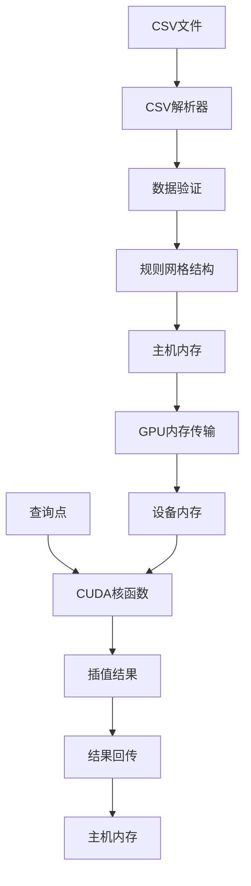

# 三维磁场数据插值模块开发计划 (C++ + CUDA)

## 1. 项目概述

### 1.1 项目目标
开发一个高性能的C++/CUDA三维磁场数据处理和插值计算库，支持：
- 从CSV文本文件导入三维空间点坐标及对应的磁场强度和梯度数据
- 在GPU端对任意空间点进行高效的三线性插值计算
- 提供简洁的C++ API接口供其他应用程序调用

### 1.2 技术栈选择
- **编程语言**: C++17
- **GPU计算**: CUDA 11.0+
- **构建系统**: CMake 3.18+
- **测试框架**: Google Test
- **数据解析**: 标准库 + 自定义CSV解析器
- **计算精度**: float (单精度) / double (双精度) 可选

### 1.3 数据规格
- **输入格式**: CSV文件，每行格式为 `x,y,z,B,Bx,By,Bz`
  - x, y, z: 三维空间坐标
  - B: 磁场强度标量值
  - Bx, By, Bz: 磁场强度梯度向量分量
- **数据特征**: 规则网格数据（均匀分布）
- **数据规模**: 10^5 到 10^6 个数据点
- **插值方法**: 三线性插值（Trilinear Interpolation）

### 1.4 项目特点
- **纯计算库**: 无GUI，无可视化依赖
- **高性能**: 充分利用GPU并行计算能力
- **易集成**: 提供清晰的C++ API和示例代码
- **跨平台**: 支持Linux和Windows

---

## 2. 系统架构设计

### 2.1 整体架构



### 2.2 核心模块划分

#### 模块1: 数据解析模块 (`data_loader`)
- CSV文件读取和解析
- 数据类型转换
- 错误处理和异常机制

#### 模块2: 网格结构模块 (`grid_structure`)
- 规则网格参数管理
- 坐标转换和索引计算
- 边界检查

#### 模块3: 内存管理模块 (`memory_manager`)
- CUDA内存分配和释放
- 主机-设备数据传输
- 内存池管理（可选）

#### 模块4: 插值计算模块
- CPU端插值实现 (`cpu_interpolator`) - 验证用
- CUDA核函数 (`cuda_kernels`) - 主要实现

#### 模块5: API接口模块 (`api`)
- 对外接口封装
- 参数验证
- 资源管理（RAII）

#### 模块6: 工具模块 (`utils`)
- 性能计时器
- 日志系统
- 错误码定义

---

## 3. 详细模块设计

### 3.1 项目目录结构

```
pointer3d_interp/
├── include/
│   └── pointer3d_interp/
│       ├── api.h                    # 主要API接口
│       ├── data_loader.h            # 数据加载器
│       ├── grid_structure.h         # 网格结构定义
│       ├── interpolator.h           # 插值器接口
│       ├── types.h                  # 类型定义
│       └── error_codes.h            # 错误码定义
├── src/
│   ├── data_loader.cpp              # CSV解析实现
│   ├── grid_structure.cpp           # 网格结构实现
│   ├── cpu_interpolator.cpp         # CPU插值实现
│   ├── cuda_interpolator.cu         # CUDA核函数
│   ├── memory_manager.cu            # GPU内存管理
│   └── api.cpp                      # API实现
├── tests/
│   ├── test_data_loader.cpp
│   ├── test_grid_structure.cpp
│   ├── test_cpu_interpolator.cpp
│   ├── test_cuda_interpolator.cpp
│   ├── test_accuracy.cpp
│   └── benchmark.cpp
├── examples/
│   ├── basic_usage.cpp
│   ├── batch_query.cpp
│   └── performance_test.cpp
├── data/
│   └── sample_magnetic_field.csv
├── cmake/
│   ├── FindCUDA.cmake
│   └── CompilerOptions.cmake
├── docs/
│   ├── API_Reference.md
│   ├── Build_Guide.md
│   └── Performance_Guide.md
├── CMakeLists.txt
├── README.md
└── LICENSE
```

### 3.2 核心数据结构设计

#### types.h
```cpp
#ifndef POINTER3D_INTERP_TYPES_H
#define POINTER3D_INTERP_TYPES_H

#include <cstdint>
#include <array>

namespace p3d {

// 精度选择：使用float或double
#ifdef USE_DOUBLE_PRECISION
using Real = double;
#else
using Real = float;
#endif

// 三维点结构
struct Point3D {
    Real x, y, z;
    
    __host__ __device__
    Point3D(Real x_ = 0, Real y_ = 0, Real z_ = 0) 
        : x(x_), y(y_), z(z_) {}
};

// 磁场数据结构
struct MagneticFieldData {
    Real field_strength;        // B
    Real gradient_x;            // Bx
    Real gradient_y;            // By
    Real gradient_z;            // Bz
};

// 网格参数结构
struct GridParams {
    Point3D origin;             // 网格起点
    Point3D spacing;            // 网格间距 (dx, dy, dz)
    std::array<uint32_t, 3> dimensions;  // 网格维度 (nx, ny, nz)
    
    // 边界
    Point3D min_bound;
    Point3D max_bound;
};

// 插值结果
struct InterpolationResult {
    MagneticFieldData data;
    bool valid;                 // 是否在有效范围内
};

} // namespace p3d

#endif // POINTER3D_INTERP_TYPES_H
```

### 3.3 主要API接口设计

#### api.h
```cpp
#ifndef POINTER3D_INTERP_API_H
#define POINTER3D_INTERP_API_H

#include "types.h"
#include "error_codes.h"
#include <string>
#include <vector>
#include <memory>

namespace p3d {

// 前向声明
class InterpolatorImpl;

/**
 * @brief 磁场数据插值器主类
 * 
 * 这是库的主要接口类，负责数据加载、GPU资源管理和插值计算
 */
class MagneticFieldInterpolator {
public:
    /**
     * @brief 构造函数
     * @param use_gpu 是否使用GPU加速（默认true）
     * @param device_id GPU设备ID（默认0）
     */
    explicit MagneticFieldInterpolator(bool use_gpu = true, int device_id = 0);
    
    ~MagneticFieldInterpolator();
    
    // 禁止拷贝，允许移动
    MagneticFieldInterpolator(const MagneticFieldInterpolator&) = delete;
    MagneticFieldInterpolator& operator=(const MagneticFieldInterpolator&) = delete;
    MagneticFieldInterpolator(MagneticFieldInterpolator&&) noexcept;
    MagneticFieldInterpolator& operator=(MagneticFieldInterpolator&&) noexcept;
    
    /**
     * @brief 从CSV文件加载磁场数据
     * @param filepath CSV文件路径
     * @return 错误码
     */
    ErrorCode LoadFromCSV(const std::string& filepath);
    
    /**
     * @brief 从内存加载数据
     * @param points 坐标数组
     * @param field_data 磁场数据数组
     * @param count 数据点数量
     * @return 错误码
     */
    ErrorCode LoadFromMemory(
        const Point3D* points,
        const MagneticFieldData* field_data,
        size_t count
    );
    
    /**
     * @brief 单点插值查询
     * @param query_point 查询点坐标
     * @param result 输出结果
     * @return 错误码
     */
    ErrorCode Query(const Point3D& query_point, InterpolationResult& result);
    
    /**
     * @brief 批量插值查询
     * @param query_points 查询点数组
     * @param results 输出结果数组
     * @param count 查询点数量
     * @return 错误码
     */
    ErrorCode QueryBatch(
        const Point3D* query_points,
        InterpolationResult* results,
        size_t count
    );
    
    /**
     * @brief 获取网格参数
     * @return 网格参数
     */
    const GridParams& GetGridParams() const;
    
    /**
     * @brief 检查是否已加载数据
     * @return true表示已加载
     */
    bool IsDataLoaded() const;
    
    /**
     * @brief 获取数据点数量
     * @return 数据点数量
     */
    size_t GetDataPointCount() const;

private:
    std::unique_ptr<InterpolatorImpl> impl_;
};

} // namespace p3d

#endif // POINTER3D_INTERP_API_H
```

#### error_codes.h
```cpp
#ifndef POINTER3D_INTERP_ERROR_CODES_H
#define POINTER3D_INTERP_ERROR_CODES_H

namespace p3d {

enum class ErrorCode {
    Success = 0,
    FileNotFound,
    FileReadError,
    InvalidFileFormat,
    InvalidGridData,
    MemoryAllocationError,
    CudaError,
    InvalidParameter,
    DataNotLoaded,
    QueryOutOfBounds,
    UnknownError
};

const char* ErrorCodeToString(ErrorCode code);

} // namespace p3d

#endif // POINTER3D_INTERP_ERROR_CODES_H
```

### 3.4 CUDA核函数设计

#### cuda_kernels.cu
```cpp
#include "types.h"
#include <cuda_runtime.h>

namespace p3d {
namespace cuda {

/**
 * @brief CUDA核函数：三线性插值
 * 
 * 每个线程处理一个查询点的插值计算
 * 
 * @param query_points 查询点数组（设备内存）
 * @param grid_data 网格数据数组（设备内存）
 * @param grid_params 网格参数
 * @param results 输出结果数组（设备内存）
 * @param count 查询点数量
 */
__global__
void TrilinearInterpolationKernel(
    const Point3D* query_points,
    const MagneticFieldData* grid_data,
    GridParams grid_params,
    InterpolationResult* results,
    size_t count
);

/**
 * @brief 设备端函数：世界坐标转网格坐标
 */
__device__
inline void WorldToGrid(
    const Point3D& world_point,
    const GridParams& params,
    Point3D& grid_coords
) {
    grid_coords.x = (world_point.x - params.origin.x) / params.spacing.x;
    grid_coords.y = (world_point.y - params.origin.y) / params.spacing.y;
    grid_coords.z = (world_point.z - params.origin.z) / params.spacing.z;
}

/**
 * @brief 设备端函数：获取网格单元格索引
 */
__device__
inline uint32_t GetGridIndex(
    uint32_t i, uint32_t j, uint32_t k,
    const GridParams& params
) {
    return i + j * params.dimensions[0] + k * params.dimensions[0] * params.dimensions[1];
}

/**
 * @brief 设备端函数：执行三线性插值
 */
__device__
MagneticFieldData TrilinearInterpolate(
    const Point3D& grid_coords,
    const MagneticFieldData* grid_data,
    const GridParams& params
);

} // namespace cuda
} // namespace p3d
```

### 3.5 三线性插值算法实现

#### 算法详细说明

对于规则网格中的任意查询点 P(x, y, z)：

**步骤1**: 坐标转换
```cpp
// 世界坐标 -> 网格坐标
float gx = (x - origin.x) / spacing.x;
float gy = (y - origin.y) / spacing.y;
float gz = (z - origin.z) / spacing.z;
```

**步骤2**: 找到包含点的单元格
```cpp
int i0 = floor(gx);  int i1 = i0 + 1;
int j0 = floor(gy);  int j1 = j0 + 1;
int k0 = floor(gz);  int k1 = k0 + 1;
```

**步骤3**: 计算局部坐标（0到1之间）
```cpp
float tx = gx - i0;
float ty = gy - j0;
float tz = gz - k0;
```

**步骤4**: 获取8个顶点的数据值
```cpp
// V[i,j,k] 表示网格点 (i,j,k) 的值
V000 = grid_data[GetIndex(i0, j0, k0)];
V001 = grid_data[GetIndex(i0, j0, k1)];
V010 = grid_data[GetIndex(i0, j1, k0)];
V011 = grid_data[GetIndex(i0, j1, k1)];
V100 = grid_data[GetIndex(i1, j0, k0)];
V101 = grid_data[GetIndex(i1, j0, k1)];
V110 = grid_data[GetIndex(i1, j1, k0)];
V111 = grid_data[GetIndex(i1, j1, k1)];
```

**步骤5**: 三次线性插值
```cpp
// X方向插值（4次）
c00 = V000 * (1 - tx) + V100 * tx;
c01 = V001 * (1 - tx) + V101 * tx;
c10 = V010 * (1 - tx) + V110 * tx;
c11 = V011 * (1 - tx) + V111 * tx;

// Y方向插值（2次）
c0 = c00 * (1 - ty) + c10 * ty;
c1 = c01 * (1 - ty) + c11 * ty;

// Z方向插值（1次）
result = c0 * (1 - tz) + c1 * tz;
```

#### CUDA实现优化

```cpp
__device__
MagneticFieldData TrilinearInterpolate(
    const Point3D& grid_coords,
    const MagneticFieldData* grid_data,
    const GridParams& params
) {
    // 获取单元格索引
    int i0 = __float2int_rd(grid_coords.x);  // 向下取整
    int j0 = __float2int_rd(grid_coords.y);
    int k0 = __float2int_rd(grid_coords.z);
    
    int i1 = i0 + 1;
    int j1 = j0 + 1;
    int k1 = k0 + 1;
    
    // 边界检查
    if (i0 < 0 || i1 >= params.dimensions[0] ||
        j0 < 0 || j1 >= params.dimensions[1] ||
        k0 < 0 || k1 >= params.dimensions[2]) {
        return MagneticFieldData{0, 0, 0, 0};  // 超出边界
    }
    
    // 局部坐标
    Real tx = grid_coords.x - i0;
    Real ty = grid_coords.y - j0;
    Real tz = grid_coords.z - k0;
    
    // 获取8个顶点的数据（合并访问）
    #define V(i,j,k) grid_data[GetGridIndex(i, j, k, params)]
    
    MagneticFieldData v000 = V(i0, j0, k0);
    MagneticFieldData v001 = V(i0, j0, k1);
    MagneticFieldData v010 = V(i0, j1, k0);
    MagneticFieldData v011 = V(i0, j1, k1);
    MagneticFieldData v100 = V(i1, j0, k0);
    MagneticFieldData v101 = V(i1, j0, k1);
    MagneticFieldData v110 = V(i1, j1, k0);
    MagneticFieldData v111 = V(i1, j1, k1);
    
    #undef V
    
    // 执行插值（对每个分量）
    MagneticFieldData result;
    
    // 插值宏定义（减少代码重复）
    #define INTERP_COMPONENT(comp) \
        Real c00_##comp = v000.comp * (1 - tx) + v100.comp * tx; \
        Real c01_##comp = v001.comp * (1 - tx) + v101.comp * tx; \
        Real c10_##comp = v010.comp * (1 - tx) + v110.comp * tx; \
        Real c11_##comp = v011.comp * (1 - tx) + v111.comp * tx; \
        Real c0_##comp = c00_##comp * (1 - ty) + c10_##comp * ty; \
        Real c1_##comp = c01_##comp * (1 - ty) + c11_##comp * ty; \
        result.comp = c0_##comp * (1 - tz) + c1_##comp * tz;
    
    INTERP_COMPONENT(field_strength)
    INTERP_COMPONENT(gradient_x)
    INTERP_COMPONENT(gradient_y)
    INTERP_COMPONENT(gradient_z)
    
    #undef INTERP_COMPONENT
    
    return result;
}
```

---

## 4. 开发步骤详解

### 阶段1: 基础框架搭建（第1-2周）

#### 步骤1: 项目初始化和CMake配置

**CMakeLists.txt**
```cmake
cmake_minimum_required(VERSION 3.18)
project(pointer3d_interp LANGUAGES CXX CUDA)

# 设置C++标准
set(CMAKE_CXX_STANDARD 17)
set(CMAKE_CXX_STANDARD_REQUIRED ON)

# 设置CUDA架构
set(CMAKE_CUDA_ARCHITECTURES 60 70 75 80 86)

# 选项
option(USE_DOUBLE_PRECISION "Use double precision" OFF)
option(BUILD_TESTS "Build tests" ON)
option(BUILD_EXAMPLES "Build examples" ON)

# 精度设置
if(USE_DOUBLE_PRECISION)
    add_definitions(-DUSE_DOUBLE_PRECISION)
endif()

# 包含目录
include_directories(${PROJECT_SOURCE_DIR}/include)

# 源文件
set(SOURCES
    src/data_loader.cpp
    src/grid_structure.cpp
    src/cpu_interpolator.cpp
    src/api.cpp
)

set(CUDA_SOURCES
    src/cuda_interpolator.cu
    src/memory_manager.cu
)

# 静态库
add_library(pointer3d_interp STATIC ${SOURCES} ${CUDA_SOURCES})

# CUDA编译选项
target_compile_options(pointer3d_interp PRIVATE
    $<$<COMPILE_LANGUAGE:CUDA>:
        --use_fast_math
        --expt-relaxed-constexpr
    >
)

# 链接CUDA库
target_link_libraries(pointer3d_interp PUBLIC cudart)

# 安装规则
install(TARGETS pointer3d_interp
    LIBRARY DESTINATION lib
    ARCHIVE DESTINATION lib
)

install(DIRECTORY include/pointer3d_interp
    DESTINATION include
)

# 测试
if(BUILD_TESTS)
    enable_testing()
    add_subdirectory(tests)
endif()

# 示例
if(BUILD_EXAMPLES)
    add_subdirectory(examples)
endif()
```

#### 步骤2: 实现基础数据结构

实现 [`types.h`](types.h:1)、[`error_codes.h`](error_codes.h:1) 和 [`error_codes.cpp`](error_codes.cpp:1)

#### 步骤3: CSV数据加载器

实现 [`data_loader.h`](data_loader.h:1) 和 [`data_loader.cpp`](data_loader.cpp:1)

关键功能：
- 使用标准库 `<fstream>` 读取文件
- 解析CSV格式（处理逗号、空格、制表符）
- 数据验证和错误处理
- 自动检测网格规则性

### 阶段2: 核心插值功能（第3-6周）

#### 步骤4: 网格结构实现

实现 [`grid_structure.h`](grid_structure.h:1) 和 [`grid_structure.cpp`](grid_structure.cpp:1)

关键功能：
- 从数据点计算网格参数
- 坐标转换函数
- 网格索引计算
- 边界检查

#### 步骤5: CPU版本插值（验证基准）

实现 [`cpu_interpolator.h`](cpu_interpolator.h:1) 和 [`cpu_interpolator.cpp`](cpu_interpolator.cpp:1)

用途：
- 作为正确性验证的参考实现
- 在无GPU环境下的fallback
- 调试工具

#### 步骤6: CUDA核函数实现

实现 [`cuda_kernels.cu`](cuda_kernels.cu:1)

关键优化：
- 使用 `__device__` 内联函数
- 合理的线程块大小（256或512）
- 合并内存访问
- 避免分支发散

#### 步骤7: GPU内存管理

实现 [`memory_manager.h`](memory_manager.h:1) 和 [`memory_manager.cu`](memory_manager.cu:1)

关键功能：
- RAII风格的内存管理
- 异步数据传输（cudaMemcpyAsync）
- 错误检查和异常处理
- 内存对齐优化

### 阶段3: API和集成（第7-8周）

#### 步骤8: API接口实现

实现 [`api.h`](api.h:1) 和 [`api.cpp`](api.cpp:1)

设计原则：
- RAII：自动资源管理
- Pimpl模式：隐藏实现细节
- 异常安全：使用错误码而非异常
- 线程安全：可选的同步机制

#### 步骤9: 批处理优化

关键技术：
- 动态批处理大小
- CUDA流（cudaStream）并行
- 分页传输大数据集
- 性能调优

### 阶段4: 测试和文档（第9-10周）

#### 步骤10: 测试套件

使用Google Test框架：

```cpp
// test_accuracy.cpp
TEST(InterpolationTest, KnownValues) {
    // 创建简单的测试网格
    // 使用已知的解析解验证
}

TEST(InterpolationTest, CPUGPUConsistency) {
    // 比较CPU和GPU结果
    // 误差应小于epsilon
}

TEST(InterpolationTest, BoundaryConditions) {
    // 测试边界情况
}
```

#### 步骤11: 性能基准测试

```cpp
// benchmark.cpp
void BenchmarkInterpolation() {
    std::vector<size_t> data_sizes = {1e4, 1e5, 1e6};
    std::vector<size_t> query_sizes = {1e2, 1e3, 1e4, 1e5};
    
    for (auto data_size : data_sizes) {
        for (auto query_size : query_sizes) {
            // 测量时间和吞吐量
        }
    }
}
```

#### 步骤12: 文档编写

- API参考文档（Doxygen格式）
- 构建指南
- 使用示例
- 性能调优指南

---

## 5. 核心技术难点

### 5.1 内存对齐和合并访问

**问题**: GPU内存访问效率对性能影响巨大

**解决方案**:
```cpp
// 使用结构体数组（SoA）而非数组结构体（AoS）
// 不推荐（AoS）：
struct Data { float x, y, z; };
Data* data;

// 推荐（SoA）：
struct DataSoA {
    float* x;
    float* y;
    float* z;
};
```

### 5.2 边界条件处理

**策略**:
1. **夹断（Clamp）**: 限制在网格范围内
2. **外推**: 使用最近邻值
3. **返回NaN**: 标记无效

```cpp
__device__
bool CheckBounds(const Point3D& grid_coords, const GridParams& params) {
    return (grid_coords.x >= 0 && grid_coords.x < params.dimensions[0] - 1) &&
           (grid_coords.y >= 0 && grid_coords.y < params.dimensions[1] - 1) &&
           (grid_coords.z >= 0 && grid_coords.z < params.dimensions[2] - 1);
}
```

### 5.3 大数据集处理

**问题**: GPU内存可能不足以容纳所有数据

**解决方案**:
```cpp
// 分块处理
const size_t MAX_GPU_MEMORY = 2ULL * 1024 * 1024 * 1024;  // 2GB
const size_t chunk_size = MAX_GPU_MEMORY / sizeof(MagneticFieldData);

for (size_t offset = 0; offset < total_queries; offset += chunk_size) {
    size_t current_chunk = std::min(chunk_size, total_queries - offset);
    // 处理当前块
    CudaInterpolate(query_points + offset, results + offset, current_chunk);
}
```

### 5.4 精度和性能权衡

**float vs double**:
- float: 更快，占用内存少，但精度约7位有效数字
- double: 较慢，占用内存多，但精度约15位有效数字

**建议**: 默认使用float，提供编译选项切换

---

## 6. 性能优化策略

### 6.1 CUDA核函数优化

```cpp
// 优化1: 线程块大小
const int BLOCK_SIZE = 256;  // 通常256或512最优

// 优化2: 使用共享内存（如果有频繁访问的数据）
__shared__ GridParams shared_params;
if (threadIdx.x == 0) {
    shared_params = params;
}
__syncthreads();

// 优化3: 使用fast math
__device__ float fast_sqrt(float x) {
    return __fsqrt_rn(x);  // 快速平方根
}

// 优化4: 避免分支
// 使用数学运算代替if-else
float valid = (condition) ? 1.0f : 0.0f;
result = result * valid;
```

### 6.2 内存访问优化

```cpp
// 预取数据到寄存器
const MagneticFieldData* __restrict__ grid_ptr = grid_data;

// 合并访问：确保相邻线程访问相邻内存
int tid = blockIdx.x * blockDim.x + threadIdx.x;
MagneticFieldData data = grid_ptr[tid];
```

### 6.3 异步执行

```cpp
// 使用CUDA流重叠计算和传输
cudaStream_t stream1, stream2;
cudaStreamCreate(&stream1);
cudaStreamCreate(&stream2);

// 流1：传输数据
cudaMemcpyAsync(d_data1, h_data1, size, cudaMemcpyHostToDevice, stream1);

// 流2：同时执行计算
KernelFunction<<<grid, block, 0, stream2>>>(...);
```

---

## 7. 使用示例

### 7.1 基本使用

```cpp
#include <pointer3d_interp/api.h>
#include <iostream>

int main() {
    using namespace p3d;
    
    // 创建插值器实例
    MagneticFieldInterpolator interp;
    
    // 加载数据
    ErrorCode err = interp.LoadFromCSV("magnetic_field_data.csv");
    if (err != ErrorCode::Success) {
        std::cerr << "Failed to load data: " 
                  << ErrorCodeToString(err) << std::endl;
        return 1;
    }
    
    // 查询单点
    Point3D query_point(1.5, 2.3, 0.8);
    InterpolationResult result;
    
    err = interp.Query(query_point, result);
    if (err == ErrorCode::Success && result.valid) {
        std::cout << "Field strength: " << result.data.field_strength << std::endl;
        std::cout << "Gradient: (" 
                  << result.data.gradient_x << ", "
                  << result.data.gradient_y << ", "
                  << result.data.gradient_z << ")" << std::endl;
    }
    
    return 0;
}
```

### 7.2 批量查询

```cpp
#include <pointer3d_interp/api.h>
#include <vector>
#include <chrono>

int main() {
    using namespace p3d;
    
    MagneticFieldInterpolator interp;
    interp.LoadFromCSV("data.csv");
    
    // 准备查询点
    const size_t num_queries = 100000;
    std::vector<Point3D> query_points(num_queries);
    std::vector<InterpolationResult> results(num_queries);
    
    // 生成随机查询点
    const auto& params = interp.GetGridParams();
    for (size_t i = 0; i < num_queries; ++i) {
        query_points[i].x = RandomFloat(params.min_bound.x, params.max_bound.x);
        query_points[i].y = RandomFloat(params.min_bound.y, params.max_bound.y);
        query_points[i].z = RandomFloat(params.min_bound.z, params.max_bound.z);
    }
    
    // 批量查询
    auto start = std::chrono::high_resolution_clock::now();
    
    ErrorCode err = interp.QueryBatch(
        query_points.data(),
        results.data(),
        num_queries
    );
    
    auto end = std::chrono::high_resolution_clock::now();
    auto duration = std::chrono::duration_cast<std::chrono::milliseconds>(end - start);
    
    if (err == ErrorCode::Success) {
        double throughput = num_queries / (duration.count() / 1000.0);
        std::cout << "Processed " << num_queries << " queries in " 
                  << duration.count() << " ms\n";
        std::cout << "Throughput: " << throughput << " queries/sec\n";
    }
    
    return 0;
}
```

---

## 8. 测试策略

### 8.1 单元测试清单

- [x] CSV文件解析
  - [ ] 正常格式文件
  - [ ] 异常格式处理
  - [ ] 大文件处理
- [x] 网格参数自动检测
  - [ ] 规则网格检测
  - [ ] 不规则数据检测
- [x] 坐标转换正确性
- [x] CPU插值算法
  - [ ] 已知解析解验证
  - [ ] 边界条件
- [x] GPU插值算法
  - [ ] 与CPU结果对比
  - [ ] 精度测试
- [x] 内存管理
  - [ ] 内存泄漏检测
  - [ ] 大数据处理

### 8.2 性能测试

**目标性能指标**:

| 测试项 | 目标 |
|--------|------|
| 数据加载（10^6点） | < 2秒 |
| 数据传输到GPU | < 100ms |
| 单次插值延迟（1000点） | < 1ms |
| 批量插值吞吐量 | > 1M 查询/秒 |

**测试代码**:
```cpp
// benchmark.cpp
void RunBenchmark() {
    const std::vector<size_t> DATA_SIZES = {10000, 100000, 1000000};
    const std::vector<size_t> QUERY_SIZES = {100, 1000, 10000, 100000};
    
    for (auto data_size : DATA_SIZES) {
        // 生成测试数据
        auto test_data = GenerateTestGrid(data_size);
        
        MagneticFieldInterpolator gpu_interp(true);
        MagneticFieldInterpolator cpu_interp(false);
        
        gpu_interp.LoadFromMemory(/*...*/);
        cpu_interp.LoadFromMemory(/*...*/);
        
        for (auto query_size : QUERY_SIZES) {
            auto queries = GenerateRandomQueries(query_size);
            
            // GPU测试
            auto gpu_time = MeasureQueryTime(gpu_interp, queries);
            
            // CPU测试
            auto cpu_time = MeasureQueryTime(cpu_interp, queries);
            
            // 输出结果
            std::cout << "Data: " << data_size 
                      << ", Query: " << query_size << "\n";
            std::cout << "  GPU: " << gpu_time << " ms, "
                      << "Speedup: " << (cpu_time / gpu_time) << "x\n";
        }
    }
}
```

---

## 9. 构建和部署

### 9.1 构建步骤

```bash
# 创建构建目录
mkdir build && cd build

# 配置（Release模式，单精度）
cmake -DCMAKE_BUILD_TYPE=Release \
      -DUSE_DOUBLE_PRECISION=OFF \
      -DBUILD_TESTS=ON \
      -DBUILD_EXAMPLES=ON ..

# 编译
cmake --build . -j8

# 运行测试
ctest --output-on-failure

# 安装
sudo cmake --install .
```

### 9.2 依赖项

**必需**:
- CMake 3.18+
- C++17兼容编译器（GCC 7+, Clang 6+, MSVC 2019+）
- CUDA Toolkit 11.0+
- NVIDIA GPU（计算能力 6.0+）

**可选**:
- Google Test（用于测试）
- Doxygen（用于文档生成）

---

## 10. 项目里程碑

| 阶段 | 时间 | 主要产出 | 验收标准 |
|------|------|----------|---------|
| 阶段1 | 第1-2周 | 项目框架、CMake、基础结构 | 编译通过，基础测试通过 |
| 阶段2 | 第3-6周 | CPU/GPU插值实现 | 正确性验证通过 |
| 阶段3 | 第7-8周 | API封装、性能优化 | 性能达标 |
| 阶段4 | 第9-10周 | 测试、文档、示例 | 完整的交付物 |

---

## 11. 风险评估

| 风险 | 可能性 | 影响 | 应对措施 |
|------|--------|------|----------|
| GPU内存不足 | 中 | 高 | 实现分块处理 |
| 性能未达预期 | 中 | 中 | 专项优化，使用profiler |
| 精度问题 | 低 | 高 | 提供double选项，充分测试 |
| 平台兼容性 | 中 | 中 | 支持多种CUDA架构 |

---

## 12. 参考资料

### 算法
- "Numerical Recipes", Chapter 3.6 - Interpolation
- NVIDIA CUDA Programming Guide

### 技术文档
- [CUDA C++ Programming Guide](https://docs.nvidia.com/cuda/cuda-c-programming-guide/)
- [CUDA Best Practices Guide](https://docs.nvidia.com/cuda/cuda-c-best-practices-guide/)

---

## 附录A: 编译选项

```bash
# Debug模式（包含调试信息）
cmake -DCMAKE_BUILD_TYPE=Debug ..

# Release模式（最大优化）
cmake -DCMAKE_BUILD_TYPE=Release ..

# 双精度
cmake -DUSE_DOUBLE_PRECISION=ON ..

# 指定CUDA架构
cmake -DCMAKE_CUDA_ARCHITECTURES="75;80;86" ..

# 禁用测试和示例
cmake -DBUILD_TESTS=OFF -DBUILD_EXAMPLES=OFF ..
```

---

## 附录B: 性能调优检查清单

- [ ] 使用 `--use_fast_math` 编译选项
- [ ] 优化线程块大小（通常256或512）
- [ ] 合并内存访问模式
- [ ] 使用 `__restrict__` 关键字
- [ ] 避免分支发散
- [ ] 使用常量内存（对于小的只读数据）
- [ ] 使用纹理内存（对于有空间局部性的数据）
- [ ] 使用异步操作重叠计算和传输
- [ ] Profile代码找到瓶颈（使用 nvprof 或 Nsight）

---

## 总结

本开发计划为C++/CUDA三维磁场数据插值库提供了完整的实现路线。关键特点：

1. **高性能**: 充分利用GPU并行能力
2. **易集成**: 简洁的C++ API
3. **可靠性**: 完整的测试覆盖
4. **灵活性**: 支持单精度/双精度切换

预计开发周期10周，可在6-7周完成核心功能。
