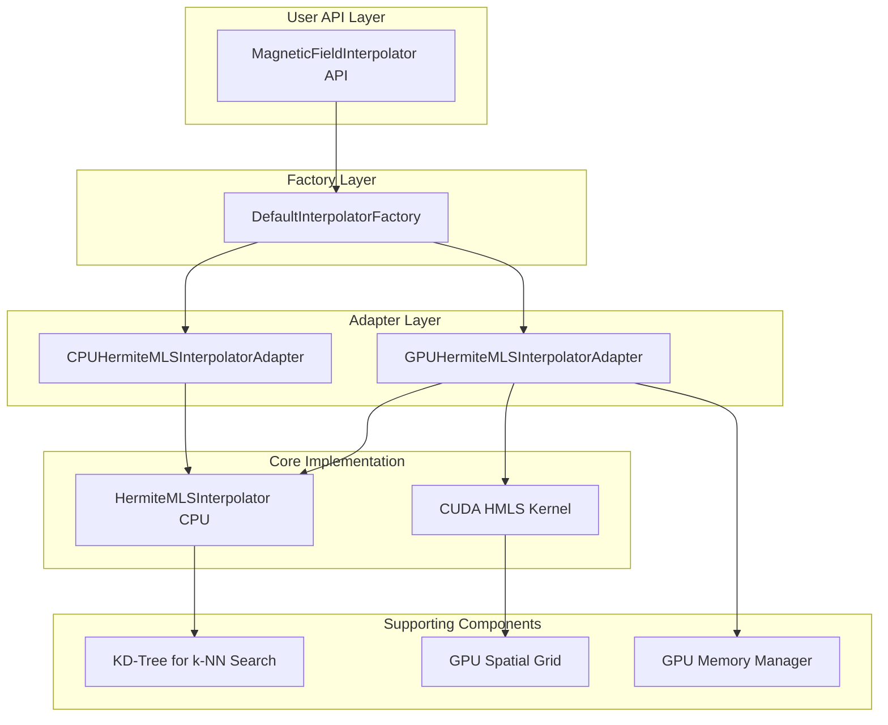
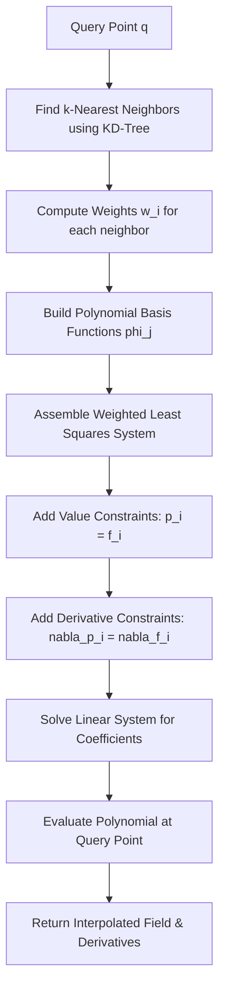
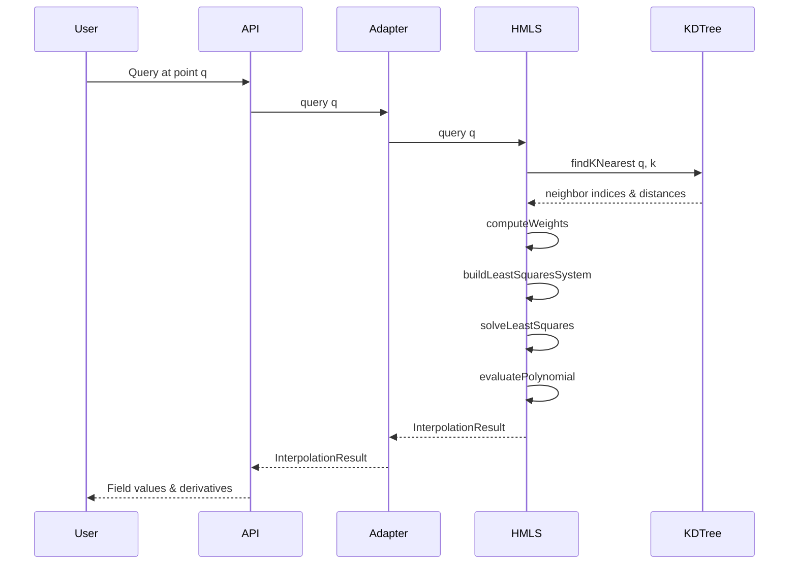
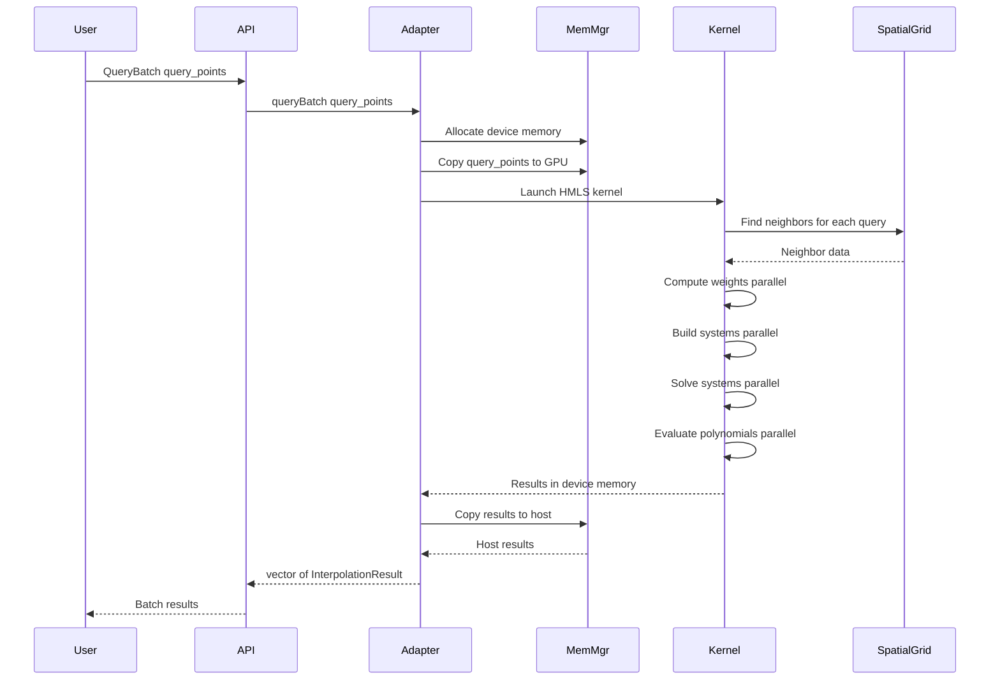
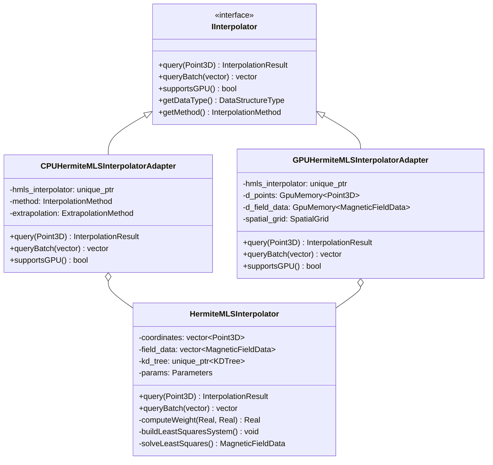
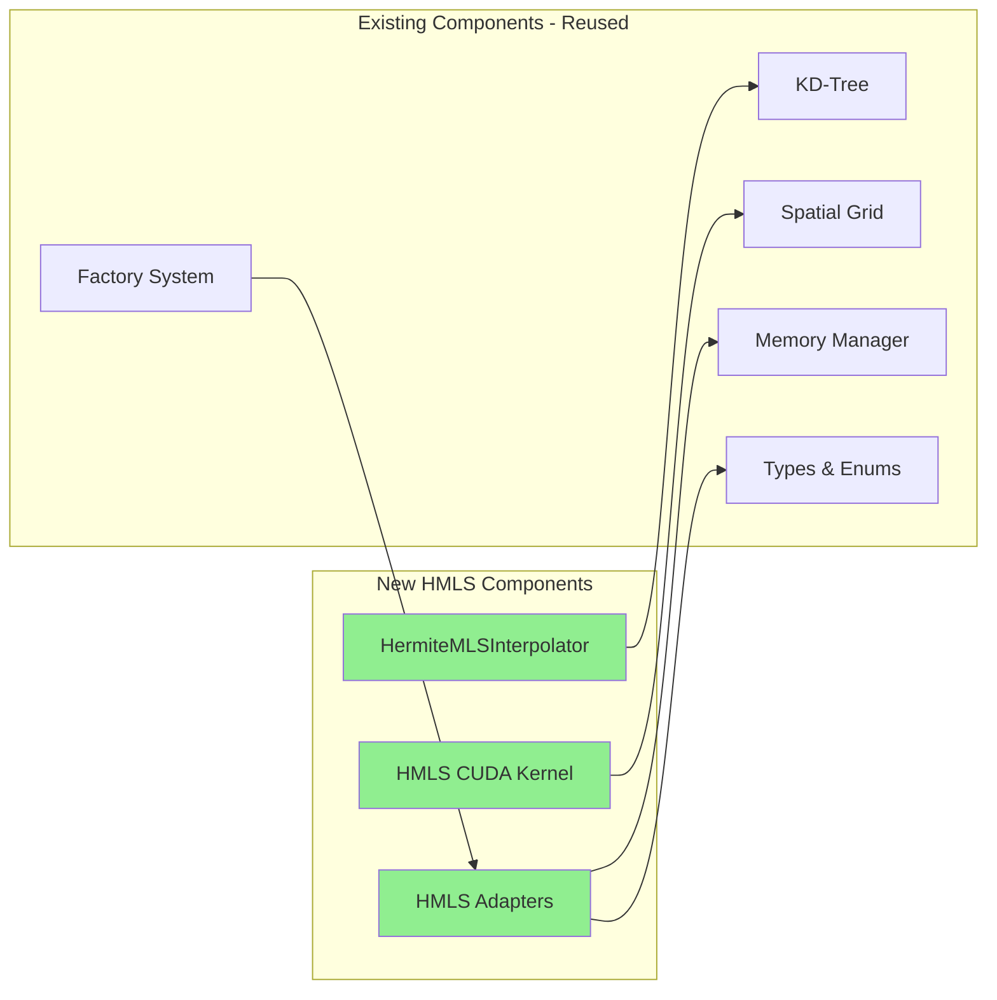
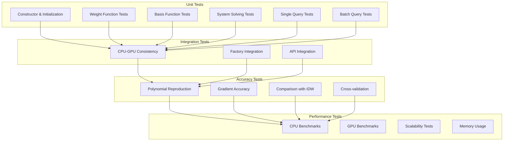

# HMLS Architecture Diagrams

## System Architecture Overview



## HMLS Algorithm Flow



## Data Flow - CPU Implementation



## Data Flow - GPU Implementation



## Class Hierarchy



## Weighted Least Squares System Structure

For a quadratic basis with k neighbors:

```
System Matrix A (size: 4k x 10):
┌─────────────────────────────────┐
│ Value Constraints (k rows)      │  w_1^0.5 * [1, x_1-q_x, y_1-q_y, z_1-q_z, (x_1-q_x)^2, ...]
│                                 │  w_2^0.5 * [1, x_2-q_x, y_2-q_y, z_2-q_z, (x_2-q_x)^2, ...]
│                                 │  ...
├─────────────────────────────────┤
│ X-Derivative Constraints (k)    │  λ^0.5 * w_1^0.5 * d/dx[basis]
│                                 │  λ^0.5 * w_2^0.5 * d/dx[basis]
├─────────────────────────────────┤
│ Y-Derivative Constraints (k)    │  λ^0.5 * w_1^0.5 * d/dy[basis]
│                                 │  ...
├─────────────────────────────────┤
│ Z-Derivative Constraints (k)    │  λ^0.5 * w_1^0.5 * d/dz[basis]
│                                 │  ...
└─────────────────────────────────┘

Right-hand side b (size: 4k x 1):
┌─────────┐
│ f_1     │  Function values
│ f_2     │
│ ...     │
├─────────┤
│ df_1/dx │  X-derivatives
│ df_2/dx │
├─────────┤
│ df_1/dy │  Y-derivatives
│ ...     │
├─────────┤
│ df_1/dz │  Z-derivatives
│ ...     │
└─────────┘

Solve: A * p = b
where p is the vector of polynomial coefficients
```

## Integration with Existing Components



## Testing Strategy


